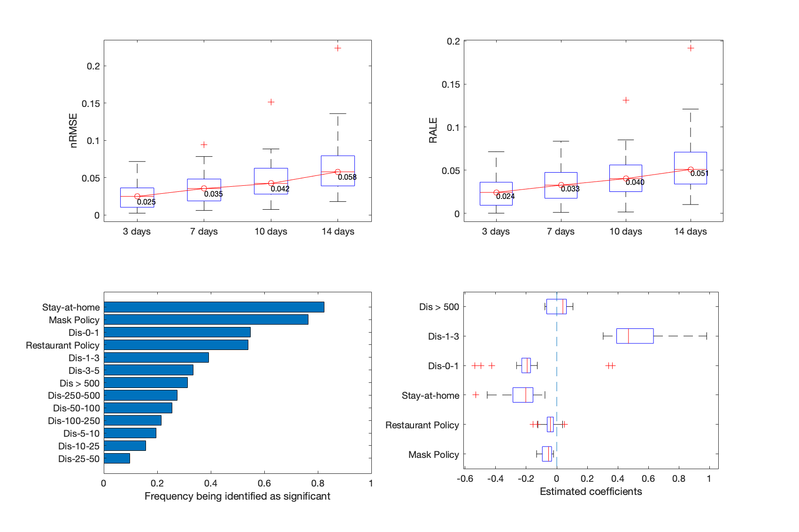
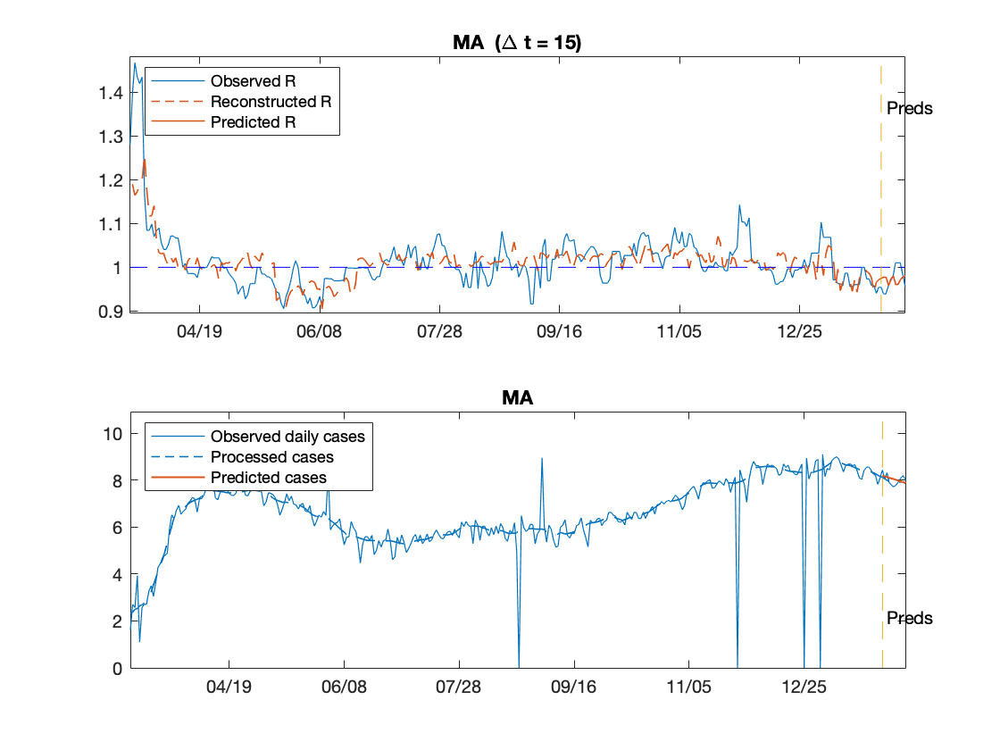

# COVID-19-Mobility
This is the MATLAB implementation of [COVID-19 Trend Forecasting Using State-level Mobility and Policy](https://www.medrxiv.org/content/medrxiv/early/2021/01/06/2021.01.04.21249218.full.pdf).

This approach estimates the transmission rates via robust regression on local mobility statistics as well as local policies. Then the prediction of daily cases can be derived in an accumulated manner. Furthermore, a novel calibration step through solving an optimization problem is added to adjust the short-term influences of implicit population behaviors, like people's consciousness of sanitation and self-protection.


## Quick usage
This work uses matlab-R2020a for implementation. Run `run.m` to see the overall model performance on 51 states (including DC). The expected running time is 5 min for a normal laptop, like MacBook Pro 2020. 

## Results
```
(Updated until 2020.02.11)
Top: Prediction evaluations on nRMSE (Normalized rMSE) and relative accumulated log error (RALE). 
Bottom: Study of independent variables being identified as statistical significant.
```


```
One example showing the 14-day prediction of COVID-19 transmission rates and confirmed cases.
```



## Instructions to run

The `data` directory is expected to contain the following files:

1. [`demographic.csv`](data/demographic.csv): State-level demographic statistics from the [U.S. Census Bureau](https://www.census.gov/data/datasets/time-series/demo/popest/2010s-counties-detail.html).
1. [`maskrequired_all.csv`](data/maskrequired_all.csv): Each state's first date of mandating mask use in public spaces from the [Department of Health & Human Services](https://healthdata.gov/dataset/covid-19-state-and-county-policy-orders).
1. [`policy_state_food_restaurant.csv`](data/policy_state_food_restaurant.csv): Each state's start and stop dates of restaurant restrictions from the [Department of Health & Human Services](https://healthdata.gov/dataset/covid-19-state-and-county-policy-orders). _(First occurence of 'start' and 'stop' under policy type 'Food and Drink')_
1. [`us-states.csv`](data/us-states.csv): [Daily confirmed cases](https://github.com/nytimes/covid-19-data) from the New York Times.
1. [`trips_state.csv`](data/trips_state.csv): The daily mobility file. Raw data is from [Trips by distance](https://data.bts.gov/Research-and-Statistics/Trips-by-Distance/w96p-f2qv) and is preprocessed using Python 3.7 as follows:
    ```python
    import pandas as pd
    import numpy as np
    from datetime import datetime

    df = pd.read_csv('Trips_by_Distance.csv')
    state_table = df[df['Level']=='State']
    dates = list(state_table['Date'])
    check = [datetime.strptime(s, '%Y/%m/%d') >= datetime.strptime('2020/01/01', '%Y/%m/%d') for s in dates]
    state_table = state_table.iloc[check, :]
    state_table.to_csv('data/trips_state.csv',index=False)
    ```

After updating the lastest files for cases and mobility, run `run.m` to see the lastest prediction results and performance. 

## Citation
If you use the code, please cite this manuscript
```
@article{wang2021state,
  title={State-level COVID-19 Trend Forecasting Using Mobility and Policy Data},
  author={Wang, Yifei and Peng, Hao and Sha, Long and Liu, Zheyuan and Hong, Pengyu},
  journal={medRxiv},
  pages={2021--01},
  year={2021},
  publisher={Cold Spring Harbor Laboratory Press}
}
```
